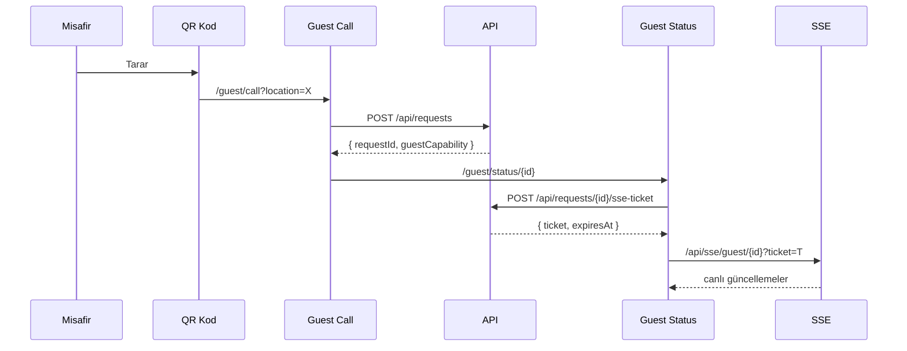

# ShuttleCall — Otel Shuttle/Buggy Çağrı Sistemi

## 📋 Genel Bakış

**ShuttleCall**, otellerdeki shuttle araçları/buggyler için tam kapsamlı bir çağrı yönetim sistemidir. Misafirler QR kod üzerinden shuttle çağırabilir, sürücüler gelen talepleri web panel üzerinden yönetebilir, yöneticiler ise canlı 3D harita, raporlar ve denetim araçlarıyla tüm süreci izleyebilir.

- **Proje Tipi**: Next.js 16.2 App Router (React 19)
- **Dil**: TypeScript (strict)
- **Veritabanı**: PostgreSQL (Prisma ORM)
- **Gerçek Zaman**: In-memory EventBus + SSE
- **Bildirimler**: Web Push (VAPID, Firebase/FCM kullanılmaz)
- **Harita**: Three.js ile 3D canlı izleme
- **Durum**: v0.1.0 — üretim hazırlığında

---

## 🏗 Mimari

### Çalışma Zamanı Topolojisi

```
Tarayıcı
  |
Reverse proxy / TLS
  |
Next.js uygulaması :3016 (tam olarak 1 replika)
  |                         |
PostgreSQL              Web Push endpoint'leri
  |
Worker (ayrı süreç, aynı imaj/kod)
```

**Kritik kural**: Tam olarak 1 replika çalıştırılmalıdır; session/rate-state ve SSE teslimatı process-local'dir. Worker ayrı bir singleton süreçtir.

### Dizin Yapısı

```
shuttlecall/
├── src/
│   ├── app/                    # Next.js App Router
│   │   ├── (admin)/admin/      # Admin panel sayfaları
│   │   ├── (auth)/             # Giriş/çıkış/şifre değiştirme
│   │   ├── (driver)/driver/    # Sürücü paneli
│   │   ├── (guest)/guest/      # Misafir çağrı/durum sayfaları
│   │   ├── (setup)/setup/      # İlk kurulum
│   │   └── api/                # Tüm API route'ları
│   ├── components/             # UI bileşenleri
│   │   ├── ui/                 # shadcn/ui bileşenleri
│   │   └── monitor/            # 3D harita bileşenleri
│   ├── hooks/                  # Custom React hooks
│   ├── lib/                    # Core kütüphaneler
│   ├── schemas/                # Zod doğrulama şemaları
│   ├── services/               # İş mantığı katmanı
│   ├── types/                  # TypeScript tipleri
│   └── workers/                # Background worker (node-cron)
├── prisma/
│   ├── schema.prisma           # Veritabanı şeması
│   └── migrations/             # Migration dosyaları
├── docs/                       # Dokümantasyon
├── tests/                      # Test dosyaları
└── scripts/                    # Yardımcı scriptler
```

---

## 🧱 Veritabanı Şeması

### Modeller

| Model | Açıklama |
|-------|----------|
| **Hotel** | Otel kaydı — kod, ad, logo, saat dilimi |
| **User** | Kullanıcı — ADMIN/DRIVER roller, kimlik doğrulama |
| **Location** | Otel içi konumlar (havuz, lobi, plaj vb.) |
| **Buggy** | Shuttle araçları — kod, model, plaka, durum |
| **BuggyDriver** | Sürücü-araç ataması (çoka-çok) |
| **BuggyRequest** | Talep — konum, durum, zaman bilgileri |
| **AuditTrail** | Denetim günlüğü — tüm değişiklikler kayıt altında |
| **Session** | Oturum yönetimi — token hash, son aktivite |
| **NotificationLog** | Bildirim geçmişi |
| **SystemSetting** | Sistem ayarları (key-value) |

### Enum'lar

| Enum | Değerler |
|------|----------|
| **UserRole** | ADMIN, DRIVER |
| **DriverStatus** | ON_DUTY, OFF_DUTY |
| **BuggyStatus** | AVAILABLE, BUSY, OFFLINE, MAINTENANCE |
| **RequestStatus** | PENDING, ACCEPTED, COMPLETED, CANCELLED, UNANSWERED |
| **CancelledBy** | DRIVER, GUEST, ADMIN, SYSTEM |
| **NotificationStatus** | PENDING, SENT, DELIVERED, FAILED, CLICKED |
| **NotificationPriority** | LOW, NORMAL, HIGH, URGENT |
| **NotificationType** | NEW_REQUEST, REQUEST_ACCEPTED, REQUEST_COMPLETED, REQUEST_CANCELLED, REQUEST_TIMEOUT, DRIVER_STATUS |

---

## 🔐 Kimlik Doğrulama ve Yetkilendirme

### Session Tabanlı Auth

- **Token üretimi**: crypto.randomBytes(32) → base64url → SHA-256 hash ile DB'de saklanır
- **Cookie**: httpOnly, sameSite=lax, production'da secure flag
- **Süre**: 24 saat (SESSION_DURATION_HOURS = 24)
- **Güvenlik**: Token hash karşılaştırması, brute-force koruması, rate limiting

### Middleware Katmanı (HOF pattern)

`src/lib/middleware.ts` — Higher-Order Function kompozisyonu:

```
// Kullanım şablonu:
export const POST = toRouteHandler(
  withRateLimit('login', { limit: 5, window: 60 },
    withValidation(schema,
      withAuth(handler, { role: 'ADMIN' })
    )
  )
)
```

| Middleware | Açıklama |
|-----------|----------|
| `withAuth(options?)` | Session doğrulama, rol kontrolü, hotel aktiflik |
| `withValidation(schema)` | Zod ile body doğrulama |
| `withRateLimit(key, options)` | In-memory sliding-window rate limiter |
| `compose(...layers)` | Çoklu HOF birleştirme |
| `toRouteHandler(innerHandler)` | InnerHandler'ı Next.js route handler'a dönüştürür |

---

## 🧩 Sayfalar / Route'lar

### Admin Sayfaları (`/(admin)/admin/`)

| Route | Açıklama |
|-------|----------|
| `/admin/dashboard` | Yönetim paneli — özet istatistikler, canlı bildirimler, araç/talep listesi, pie chart |
| `/admin/monitor` | **3D Canlı Harita** — Three.js ile otel haritası, araç konumları, çağrı marker'ları |
| `/admin/buggies` | Araç yönetimi — CRUD, sürücü atama, durum yönetimi |
| `/admin/locations` | Konum yönetimi — CRUD, QR kod oluşturma, logo yükleme, harita koordinatları |
| `/admin/users` | Kullanıcı yönetimi — admin/sürücü hesapları |
| `/admin/simulate` | Demo mod — test talepleri oluşturma |
| `/admin/reports` | Raporlar — özet ve performans raporları |
| `/admin/audit` | Denetim günlüğü |
| `/admin/settings` | Sistem ayarları — demo mod, harita, site adı |
| `/admin/settings/guest-design` | Misafir sayfası tasarımı — renkler, alanlar, logo |

### Sürücü Sayfaları (`/(driver)/driver/`)

| Route | Açıklama |
|-------|----------|
| `/driver/dashboard` | Sürücü paneli — gelen talepler, yönlendirme, işlem yönetimi |

### Misafir Sayfaları (`/(guest)/guest/`)

| Route | Açıklama |
|-------|----------|
| `/guest/call?location=<id>` | Shuttle çağrı formu — QR'dan erişilir, 6 dil desteği |
| `/guest/status/<requestId>` | Talep durum takibi — canlı SSE güncellemeleri |

### Kimlik Doğrulama (`/(auth)/`)

| Route | Açıklama |
|-------|----------|
| `/login` | Giriş sayfası |
| `/logout` | Çıkış (POST) |
| `/change-password` | Şifre değiştirme |

---

## 📡 API Route'ları

### Kimlik Doğrulama

| Method | Route | Açıklama |
|--------|-------|----------|
| POST | `/api/auth/login` | Giriş (rate limit: 5/dk) |
| POST | `/api/auth/logout` | Çıkış |
| GET | `/api/auth/me` | Mevcut kullanıcı bilgisi |
| POST | `/api/auth/change-password` | Şifre değiştirme |

### Talepler

| Method | Route | Açıklama |
|--------|-------|----------|
| POST | `/api/requests` | Misafir talep oluşturma (public, rate limit: 10/dk) |
| GET | `/api/requests` | Talep listesi (admin/driver) |
| GET | `/api/requests/active` | Aktif talepler (PENDING + ACCEPTED) |
| GET | `/api/requests/:id` | Talep detayı (auth veya guest capability ile) |
| POST | `/api/requests/:id/accept` | Talebi kabul et (sürücü) |
| POST | `/api/requests/:id/complete` | Talebi tamamla (sürücü) |
| POST | `/api/requests/:id/cancel` | İptal (admin/driver/guest) |
| POST | `/api/requests/:id/sse-ticket` | Misafir SSE bileti oluştur |

### Araçlar

| Method | Route | Açıklama |
|--------|-------|----------|
| GET | `/api/buggies` | Araç listesi (filtreleme, sayfalama) |
| POST | `/api/buggies` | Yeni araç |
| GET | `/api/buggies/:id` | Araç detayı |
| PUT | `/api/buggies/:id` | Araç güncelleme |
| DELETE | `/api/buggies/:id` | Araç silme (soft delete) |
| PUT | `/api/buggies/:id/status` | Durum güncelleme |
| GET/POST | `/api/buggies/:id/drivers` | Sürücü atama/yönetim |

### Konumlar

| Method | Route | Açıklama |
|--------|-------|----------|
| GET/POST | `/api/locations` | Konum listesi/oluşturma |
| GET/PUT/DELETE | `/api/locations/:id` | Konum detay/güncelle/sil |
| POST | `/api/locations/:id/qr` | QR kod oluştur |
| POST | `/api/locations/:id/logo` | Logo yükle |
| GET | `/api/locations/:id/settings` | Konum bazlı misafir sayfası ayarları |

### Sürücü İşlemleri

| Method | Route | Açıklama |
|--------|-------|----------|
| POST | `/api/driver/heartbeat` | Kalp atışı (30/dk rate limit) |
| POST | `/api/driver/location` | GPS konum güncelleme |
| POST | `/api/driver/status` | Vardiya durumu (ON_DUTY/OFF_DUTY) |

### Canlı Yayın (SSE)

| Method | Route | Açıklama |
|--------|-------|----------|
| GET | `/api/sse/admin` | Admin SSE kanalı |
| GET | `/api/sse/driver` | Sürücü SSE kanalı |
| GET | `/api/sse/guest/:requestId` | Misafir SSE (ticket-based) |

### Raporlar & Denetim

| Method | Route | Açıklama |
|--------|-------|----------|
| GET | `/api/reports/summary` | Özet istatistikler |
| GET | `/api/reports/performance` | Performans raporu |
| GET | `/api/audit` | Denetim günlüğü |
| GET | `/api/monitor/state` | Canlı harita durumu |

### Yönetim & Sağlık

| Method | Route | Açıklama |
|--------|-------|----------|
| GET | `/api/health` | DB bağlantı sağlık kontrolü |
| GET | `/api/health/live` | Liveness probe |
| GET | `/api/health/ready` | Readiness probe |
| GET/POST | `/api/admin/settings` | Sistem ayarları |
| GET | `/api/admin/settings/map` | Harita ayarları |
| POST | `/api/admin/simulate` | Demo talep oluşturma |
| POST | `/api/admin/reset` | Sıfırlama |
| GET/POST | `/api/admin/users` | Kullanıcı yönetimi |
| POST | `/api/setup` | İlk kurulum |
| GET | `/api/uploads/...` | Dosya sunumu |

### Web Push

| Method | Route | Açıklama |
|--------|-------|----------|
| POST | `/api/user/fcm-token` | Push subscription kaydetme |

---

## ⚙️ Servis Katmanı

Servisler `src/services/` altında modüler olarak yapılandırılmıştır:

### AuthService
- `login()` — Kimlik doğrulama + session oluşturma
- `logout()` — Session iptali
- `getMe()` — Mevcut kullanıcı detayı
- `changePassword()` — Şifre değiştirme + diğer session'ları iptal

### RequestService
- `create()` — Yeni talep (misafir capability hash ile)
- `accept()` — Talep kabul (transaction, FOR UPDATE lock, buggy durum güncelleme)
- `complete()` — Talep tamamlama (transaction, araç AVAILABLE + konum güncelleme)
- `cancel()` — İptal (transaction, araç durumu geri alma)
- `cancelByGuest()` — Misafir iptali (capability doğrulama)
- `list()` — Filtreleme + sayfalama
- `getActive()` — Aktif talepler
- `timeoutPending()` — Zaman aşımı kontrolü (1 saat)
- `getByIdPublic()` — Capability doğrulamalı public sorgu

### BuggyService
- CRUD işlemleri + sürücü atama/yönetim
- Aktif session kontrolü ile çevrimiçi/çevrimdışı durumu hesaplama
- SSE bildirimleri

### LocationService
- CRUD işlemleri + QR kod yönetimi
- Logo yükleme/silme

### MonitorService
- **MonitorState**: konumlar, araçlar (sürücü durumu + GPS), aktif talepler
- Araç efektif durumu: AVAILABLE + sürücü yoksa → OFFLINE
- En güncel GPS verisi (son 2 dk)

### NotificationService
- Web Push (VAPID) ile bildirim gönderme
- Sürücülere toplu bildirim (aktif, ON_DUTY, son 5 dk heartbeat)
- Bildirim loglama

### ReportService
- Özet istatistikler (sayılar, ortalama süreler)
- Performans raporu (sürücü bazlı, konum bazlı)
- Denetim günlüğü sorgulama

---

## 🔄 Gerçek Zamanlı Sistem

### EventBus (In-Memory)
`src/lib/event-bus.ts` — Basit publish/subscribe pattern.

**Kanal yapısı:**
- `hotel:{hotelId}` — Otel geneli olaylar (admin/driver kanalları)
- `request:{requestId}` — Talep bazlı olaylar (misafir SSE)
- `driver:{driverId}` — Sürücü kişisel kanalı

**Olay Tipleri:**
- `new_request` — Yeni talep
- `request_accepted` — Talep kabul
- `request_completed` — Talep tamamlanma
- `request_cancelled` — Talep iptal
- `buggy_status` — Araç durum değişikliği
- `buggy_location` — Araç konum değişikliği

### SSE (Server-Sent Events)
- 30 saniyede bir heartbeat
- Bağlantı koptuğunda 10 saniyede bir polling fallback
- Misafir SSE: ticket-based doğrulama (1 dk geçerli, tek kullanımlık)
- Admin: session + role kontrolü
- Sürücü: session doğrulama

---

## 📱 Misafir (Guest) Sistemi

### Mimarisi


### Güvenlik
- **Capability**: randomBytes(32) → base64url → SHA-256 hash
- **SSE Ticket**: 1 dk geçerli, tek kullanımlık
- **İptal**: capability ile doğrulama
- Public endpoint'lerde rate limiting (10 talep/dk)

### Dil Desteği (i18n)
6 dil: **Türkçe**, **English**, **Deutsch**, **Русский**, **العربية**, **Español**

### Özelleştirilebilir Misafir Sayfası
`src/lib/guest-page-config.ts` ile tamamen özelleştirilebilir:

- Renkler (arkaplan geçişi, buton, metin)
- Alanlar (ad, oda, telefon — required/optional/off)
- Özel alanlar (custom text/tel/textarea alanları)
- Buton metni ve şekli (rounded/pill)
- Logo gösterimi
- Saat gösterimi
- Altbilgi metni
- Sürücü/araç bilgisi gösterimi

---

## 🚗 Sürücü Paneli

### Özellikler
- Gelen talepleri görüntüleme
- Talep kabul/iptal/tamamlama
- Vardiya durumu (ON_DUTY/OFF_DUTY)
- Kalp atışı (heartbeat) — 30 saniyede bir
- GPS konum bildirimi
- Push bildirimleri ile anında haber alma

### Kalp Atışı Sistemi
- `POST /api/driver/heartbeat` ile 30/dk rate limit
- `lastHeartbeat` alanı güncellenir
- Worker her 60 sn'de kontrol eder: 5 dk heartbeat yoksa → OFF_DUTY

---

## 👑 Yönetim Paneli

### Dashboard
- **Araç durum kartları**: kod, ikon, konum, sürücü, durum badge
- **Aktif talepler**: talep no, durum badge, konum, araç, sürücü, zaman
- **Canlı bildirim akışı**: SSE ile anında gelen bildirimler
- **Metrik kartları**: toplam/bekleyen/tamamlanan/iptal sayıları
- **Ortalama tepki/tamamlama süreleri**
- **Pie chart**: talep durum dağılımı (recharts)

### 3D Canlı Harita
`src/components/monitor/monitor-map-3d.tsx` — Three.js ile:

- **3D otel haritası**: gerçekçi ortam, gölgelendirme
- **Araç sprite'ları**: duruma göre renk, kod etiketi, tekerlek dönüşü
- **Çağrı marker'ları**: PENDING (kırmızı, pulse efektli), ACCEPTED (mavi)
- **Konum pin'leri**: numaralı iğne sprite'ları
- **Kamera kontrolleri**: döndürme, zoom, pan, kilit modu
- **Kontrol paneli**: görünüm kilidi, 3D/üst kamera, pin göster/gizle
- **Araç hız/boyut ayarları**: kaydırıcı ile
- **Click raycast**: tıklama ile seçim

### Simülasyon Modu
- "Demo Mod" aktifken kullanılabilir
- Sahte misafir adı ve oda numarası ile test talebi oluşturma
- Son 5 simülasyon geçmişi görüntüleme

---

## ⏰ Worker Sistemi

`src/workers/index.ts` — Bağımsız süreç (`pnpm worker`)

| Cron | Görev | Açıklama |
|------|-------|----------|
| `* * * * *` (her 60 sn) | Talep zaman aşımı | 1 saat geçmiş PENDING → UNANSWERED |
| `* * * * *` (her 60 sn) | Sürücü OFF_DUTY | 5 dk heartbeatsız sürücüler OFF_DUTY |
| `0 * * * *` (her saat) | Session temizlik | Süresi dolan session'ları devre dışı bırak |
| `0 3 * * *` (günlük 03:00) | Bildirim log temizlik | 90 gün eski logları sil |

---

## 🔔 Bildirim Sistemi

- **Web Push**: VAPID protokolü (Firebase/FCM yok)
- **Push subscription**: JSON olarak kullanıcı kaydında saklanır
- **Sürücü seçimi**: Aktif, ON_DUTY, son 5 dk heartbeat olan sürücüler
- **Bildirim loglama**: NotificationLog tablosu
- **Status tracking**: PENDING → SENT → DELIVERED → CLICKED
- **Abonelik temizlik**: 410/404 hatalarında subscription temizlenir

---

## 🛡 Güvenlik

### Başlıca Önlemler
- **HTTP-only cookie** ile session yönetimi
- **bcrypt** ile şifre hash'leme
- **SHA-256** token hash (düz metin token DB'de saklanmaz)
- **Timing-safe comparison** (guest capability)
- **Rate limiting** — login: 5/dk, talep: 10/dk, heartbeat: 30/dk
- **Zod validation** — tüm girdiler doğrulanır
- **Security headers** — X-Content-Type-Options, X-Frame-Options, CSP, HSTS
- **Audit trail** — tüm state değişiklikleri kayıt altında
- **Transaction + FOR UPDATE** lock — yarış koşulları önlenir
- **Cleanup**: süresi dolmuş session, eski bildirim logları otomatik temizlik

### Transaction Desenleri
Tüm kritik state değişiklikleri `prisma.$transaction` içinde `FOR UPDATE` lock ile:
- Talep kabul (akcept)
- Talep tamamlama
- Talep iptal

---

## 🚀 Dağıtım

### Docker
```bash
docker build -t shuttlecall .
docker-compose up
```

### Ortam Değişkenleri
| Değişken | Zorunlu | Açıklama |
|----------|---------|----------|
| `DATABASE_URL` | ✅ | PostgreSQL bağlantı URL |
| `SETUP_SECRET` | ✅ | Kurulum secret (min 32 karakter) |
| `VAPID_PUBLIC_KEY` | ✅ | Web Push VAPID public key |
| `VAPID_PRIVATE_KEY` | ✅ | Web Push VAPID private key |
| `VAPID_CONTACT_EMAIL` | ✅ | VAPID iletişim email |
| `NEXTAUTH_SECRET` | production | Auth secret (min 32 karakter) |
| `NEXTAUTH_URL` | opsiyonel | Temel URL |
| `TRUST_PROXY` | opsiyonel | Traefik proxy güveni |
| `NODE_ENV` | opsiyonel | development/test/production |

### Komutlar
```bash
pnpm dev          # Geliştirme sunucusu (port 3016)
pnpm build        # Üretim build
pnpm start        # Üretim çalıştırma
pnpm worker       # Background worker
pnpm seed         # Demo verisi (manuel)
pnpm test         # Test çalıştırma
pnpm typecheck    # TypeScript kontrol
pnpm lint         # ESLint
```

---

## 🗺 Gelecek Planı (Ponytail)

| Alan | Mevcut | Yükseltme Planı |
|------|--------|-----------------|
| **EventBus** | In-memory | Redis pub/sub (çoklu replika) |
| **Rate Limiter** | In-memory Map | Redis (çoklu replika) |
| **Worker** | node-cron | BullMQ + Redis |
| **Guest files** | local storage | CDN/S3 |
| **Horizontal scaling** | 1 replika | Session/SSE koordinasyonu |

---

## 📊 Test Yapısı

- **Unit tests**: vitest (unit config)
- **Frontend tests**: vitest (jsdom, frontend config)
- **Coverage**: v8 ile coverage raporu
- **TypeScript**: strict mode + noEmit kontrolü

```bash
pnpm test              # unit + frontend
pnpm test:unit         # sadece unit
pnpm test:frontend     # sadece frontend
pnpm coverage:unit     # unit coverage
pnpm coverage:frontend # frontend coverage
```

---

## 🔑 Önemli Dizin/Dosya Referansı

| Dosya | Açıklama |
|-------|----------|
| `src/lib/middleware.ts` | HOF middleware sistemi (auth, validation, rate-limit) |
| `src/lib/event-bus.ts` | In-memory publish/subscribe |
| `src/lib/guest-capability.ts` | Misafir yetkilendirme (SHA-256 + timing-safe) |
| `src/lib/guest-page-config.ts` | Misafir sayfası tasarım yapılandırması |
| `src/lib/i18n.ts` | 6 dil çeviri sistemi |
| `src/lib/security.ts` | HTTP güvenlik başlıkları, CSP |
| `src/lib/auth.ts` | Session yönetimi, bcrypt |
| `src/lib/audit.ts` | Denetim günlüğü |
| `src/services/request-service.ts` | Talep iş mantığı (transaction'lar) |
| `src/services/monitor-service.ts` | Canlı harita durumu |
| `src/services/notification-service.ts` | Web Push bildirimleri |
| `src/workers/index.ts` | Background worker (cron jobs) |
| `src/hooks/use-monitor-state.ts` | SSE + polling ile canlı veri hook'u |
| `src/components/monitor/monitor-map-3d.tsx` | Three.js 3D harita |
| `prisma/schema.prisma` | Veritabanı şeması (9 model, 8 enum) |
